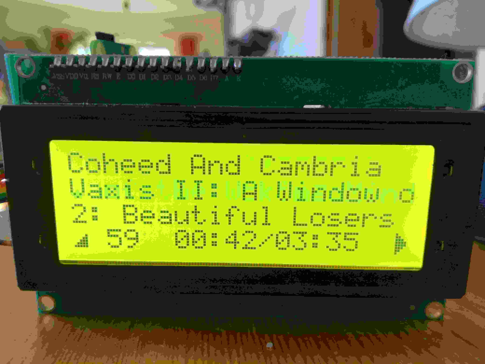

# Control Unit for MPD Server like MoOde
This programm accesses the MPD server from MoOde. There is no need for text file information from the Player Program.

The list of radiostations is placed in the MyRadio playlist. The initial Musicplaylist is MyMusic. 
The Music playlists can be changed in playlistmode. 
- First You have to press the playlist button to enter this mode. 
- Then you can choose one  of the playlists in the MoOde player (prev/next button). 
- You can start the choosen one with the start/stop button, or store it as new default by pressing the Music button a few seconds.  

## LCD 

###  Features
| Line  | Radio Stream  |  Music|
|:---------|:---------|:--------|
| 1 | date and time | Album|
| 2 | station   | interpret|
| 3 | information | track + titel |
| 4 | Volume + random + duration + start/stop state |  Volume + random + duration start/pause state |
    

    
## Keyboard

| Button  |  Radio Stream  |  Music  |  Playlist Mode|
|:---------|:---------|:--------|:-------|
| prev  | previous Station | previous Titel | prev. playlist |
| next  | next Station | next Titel | next playlist | 
| start/stop | start/stop Stream | start/pause Titel | start actual choosen playlist |
| radio | start Radio  |start Radio  | |
| music | start default Music |start default Music| press long to store new default music |
| random | random on/off | random on/off | |

## Volume
Rotary Encoder with integratet On/Off Switch.

## Schematic

# Todo:
 the volumencontrol is still done by the moOde player.
 should be implemented in the mpd client.